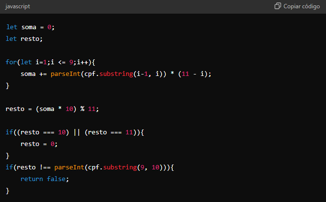
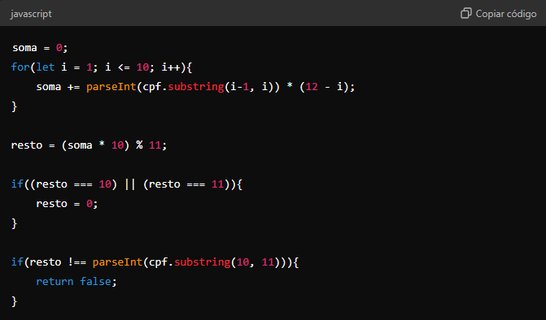
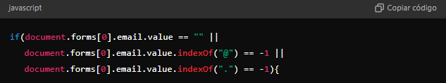
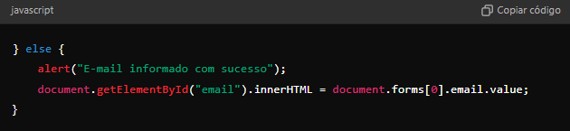

# Validação Email e CPF

Com essa atividades aprendemos o funcionamento de validação pra JavaScript, criamos arquivos que validam CPF e Email. 
Veja agora as explicações dos funcionamentos do código CPF.

## **CPF**
 
Elementos utilizados no JavaScript da Validação do CPF:
 
| Elementos | Explicações |
| --- | --- |
| ``element`` | É uma referência a um objeto ``Element``, ou null se um elemento com o ID especificado não estiver contido neste documento.
| ``id`` |  É uma string que diferência maiúsculas e minúsculas representando o ID único do elemento sendo procurado.
| ``bubmit`` | O evento submit é disparado quando é feita a submissão de um `` <form> ``
| ``preventDefault``  | Cancela o evento se for cancelável, sem parar a propagação do mesmo.
| ``const``  | A declaração ``const`` cria uma variável cujo o valor é fixo, ou seja, uma constante somente leitura.
| ``value``  | Tem a finalidade de fazer com que o comando onde ele é usado, considere o valor do parâmetro passado e não o próprio parâmetro.
| ``textContent``  | A propriedade ``textContent`` da interface ``Node`` representa o conteúdo do texto de um nó e de seus descendentes.
| ``replace``  | O ``replace()`` método de ``String`` valores retorna uma nova string com uma, algumas ou todas as correspondências de a ``pattern`` substituídas por a ``replacement``.
| ``length``  | Cancela o evento se for cancelável, sem parar a propagação do mesmo.

## **Explicações de códigos em partes:**
 
### Parte 1: Configuração do Escutador de Eventos
 

* ``document.getElementById('cpfForm')`` | Aqui, o código seleciona o formulário com o ``id`` ``cpfForm``.
 

* ``.addEventListener('submit', function(event){event.preventDefault();`` | O evento de submissão do formulário é interceptado. O método event.``preventDefault()`` é chamado para evitar que o formulário seja enviado da maneira tradicional e recarregue a página.
* ``const cpf = document.getElementById('cpf').value;`` | O código obtém o valor do campo de entrada com o id cpf.
* ``const msg = document.getElementById('message');`` | O código obtém o elemento com o id message, onde será exibida a mensagem de validação.
* ``if(validarCPF(cpf)){msg.textContent = 'O CPF é válido!';msg.style.color = 'green';}else{msg.textContent ='O CPF é inválido!';msg.style.color = 'red';}`` | A função validarCPF é chamada com o valor do CPF. Dependendo do resultado (verdadeiro ou falso), a mensagem e a cor são ajustadas para indicar se o CPF é válido ou inválido.

### Parte 2: Função de Validação do CPF
* ``function validarCPF(cpf){cpf = cpf.replace(/[^\d]+/g, ''); // Remove caracteres não numéricos`` | O código remove todos os caracteres não numéricos da string de CPF, como pontos e hífens, para deixar apenas os dígitos.
 

* ``if(cpf.length !== 11 || /^(\d)\1{10}$/.test(cpf)){return false;}`` | Verifica se o CPF tem exatamente 11 dígitos e se todos os dígitos são iguais. Se não atender a essas condições, o CPF é considerado inválido e a função retorna ``false``.

 
* Calcula a Soma Ponderada:
Itera sobre os 9 primeiros dígitos do CPF, calculando uma soma ponderada.
* Calcula o Resto e Verifica:
O resto da soma é calculado e ajustado para verificar o 10º dígito (primeiro dígito verificador). Se não coincidir com o dígito verificador, retorna ``false``.
 

 
* Calcula a Soma Ponderada:
Itera sobre todos os 10 primeiros dígitos do CPF para calcular a soma ponderada.
* Calcula o Resto e Verifica:
O resto é calculado e ajustado para verificar o 11º dígito (segundo dígito verificador). Se não coincidir, retorna ``false``.
 
| ``return true`` | Se todas as validações passarem, a função retorna ``true``, indicando que o CPF é válido.
 
### Resumo da validação do CPF
 
* O código adiciona um escutador de evento ao formulário para interceptar a submissão e validar o CPF.
* A função validarCPF verifica se o CPF tem o formato e os dígitos verificadores corretos.
* Mensagens e estilos são atualizados com base na validade do CPF.
 
##
 
## **Email**
 
### Etapas de Funcionamento:
 1. Definição da Função:
 
 | ``function checarEmail(){`` | Define uma função chamada ``checarEmail`` que será executada quando chamada, normalmente ao submeter um formulário ou clicar em um botão.
 
 2. Verificação do Campo de E-mail:
 
 
 
Aqui, o código faz uma série de verificações para validar o e-mail:
 
* ``document.forms[0].email.value == ""``: Verifica se o campo de e-mail está vazio.
* ``document.forms[0].email.value.indexOf("@") == -1``: Verifica se o caractere @ está presente no e-mail.
* ``document.forms[0].email.value.indexOf(".") == -1``: Verifica se o caractere . está presente no e-mail.
As verificações são feitas no primeiro formulário ``(forms[0])`` da página, acessando o campo de e-mail ``(email)``.
 
3. Exibição de Mensagem de Alerta e Interrupção do Processo:
 
| ``alert("Por favor, informe um e-mail válido");return false;`` | Se qualquer uma das verificações falhar, uma mensagem de alerta é exibida informando que o e-mail é inválido. A função retorna ``false``, o que normalmente interrompe o envio do formulário (se a função estiver associada a um evento de submissão).
 
4. Processamento do E-mail Válido:
 

 
Se todas as verificações passarem, uma mensagem de sucesso é exibida. O código então seleciona o elemento com o ``id`` ``email`` e atualiza seu conteúdo HTML com o valor do e-mail inserido.
 
### Resumo do funcionamento:
 
1. Verificação de Campo:
* A função verifica se o campo de e-mail está vazio ou se falta @ ou . no e-mail.
2. Feedback ao Usuário:
* Se o e-mail for inválido, exibe um alerta e interrompe a operação.
 

* Se o e-mail for válido, exibe um alerta de sucesso e mostra o e-mail em um elemento HTML com o ``id`` ``email``.
### Pontos a Considerar:
* Validação Básica:
A validação é bastante simples e pode não cobrir todos os casos válidos de endereços de e-mail. Por exemplo, e-mails como ``user.name@domain.co`` ou ``user+name@domain.com`` seriam considerados inválidos por esta função, embora sejam válidos.
 
* Uso de document.forms[0]:
A função assume que o formulário de e-mail é o primeiro no documento ``(forms[0])``. Isso pode não ser robusto se houver múltiplos formulários.
 
* Atualização do Elemento HTML:
O código assume que há um elemento HTML com o ``id`` ``email`` onde o e-mail pode ser exibido. Se esse elemento não existir, o código causará um erro.
tem menu de contexto

## Tecnologias utilizadas

 
   
   
   
 

